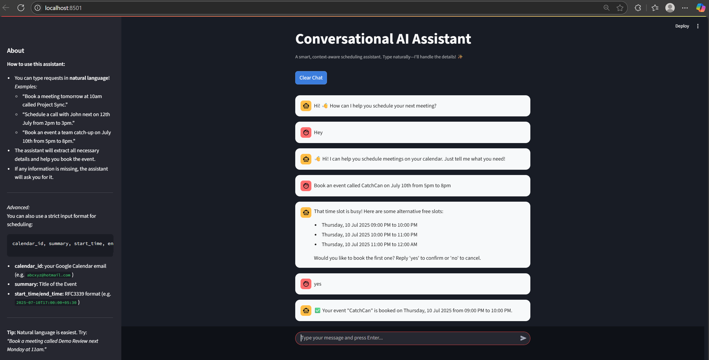

ConversationalAiAgent2
A conversational AI-powered scheduling assistant that lets users book Google Calendar events using natural language, built with FastAPI (backend), Streamlit (frontend), and Gemini (LLM).

🚀 Features
Natural language scheduling: Book, check, and suggest meeting times by chatting naturally.

Google Calendar integration: Events are created directly in your Google Calendar via a service account.

LLM-powered slot extraction: Uses Gemini via LangChain to understand user intent and extract event details.

Streamlit chat UI: Friendly, modern frontend for interactive conversations.

Secure: API keys and credentials are managed via environment variables and never committed to the repo.

🗂️ Project Structure
text
.
├── app.py              # Streamlit frontend
├── backend.py          # FastAPI backend (LLM, slot filling, booking logic)
├── calendar_utils.py   # Google Calendar utility functions
├── requirements.txt    # Python dependencies
├── .gitignore          # Git ignore file (excludes secrets, venv, etc.)
└── README.md           # This file

⚡ Quick Start
## 1. Clone the repository
- git clone https://github.com/AshrithRedx/ConversationalAiAgent2.git
- cd ConversationalAiAgent2
## 2. Set up your environment
- python -m venv venv
# Activate the venv:
# On Windows:
venv\Scripts\activate
# On Mac/Linux:
source venv/bin/activate
## 3. Install dependencies
pip install -r requirements.txt
 ### 🔑 Google API & Service Account Setup
#### 1. Create a Google Cloud Project and Enable Calendar API
- Go to the Google Cloud Console.

- Click Select a Project → New Project → Give it a name → Create.

- With your project selected, go to APIs & Services → Enable APIs and Services.

- Search for Google Calendar API and click Enable.

#### 2. Create a Service Account and Download the Key
- Go to IAM & Admin → Service Accounts.

- Click Create Service Account.

- Name it (e.g., "calendar-bot") → Create and Continue.

- Grant the Editor or Service Account Token Creator role → Done.

- In the service account list, click your new account, go to the Keys tab, and click Add Key → Create new key → Choose JSON → Create.

- Download the .json key file and keep it safe—*do NOT upload it to GitHub.*

#### 3. Share Your Google Calendar with the Service Account
- Go to Google Calendar.

- Find your calendar under "My calendars", click the three dots → Settings and sharing.

- Scroll to Share with specific people or groups.

- Add the service account’s email (from your .json file, e.g., my-bot@my-project.iam.gserviceaccount.com).

- Give it "Make changes to events" permission.

 ## 🛠️ Configuration
 ## 4. Set Up Your .env File
- In your project root, create a file named .env (not .env.txt):
 - GOOGLE_API_KEY=YOUR_GOOGLE_API_KEY
 - CALENDAR_ID=your-calendar@gmail.com
 - GOOGLE_APPLICATION_CREDENTIALS=path/to/your/service-account.json
 - GOOGLE_API_KEY: Your API key from Google Cloud Console (if required by your LLM integration).

- CALENDAR_ID: Your Google Calendar email (usually your Gmail address).

- GOOGLE_APPLICATION_CREDENTIALS: Path to your downloaded .json service account key.

Do NOT commit your .env or .json files to GitHub.
Make sure your .gitignore includes:

.env
*.json
venv/
__pycache__/
▶️ Running the Project
## 5. Run the backend

- uvicorn backend:app --reload
## 6. Run the frontend

- streamlit run app.py

## 📸 Screenshots

### Frontend (Streamlit)

### Backend (FastAPI)

 

