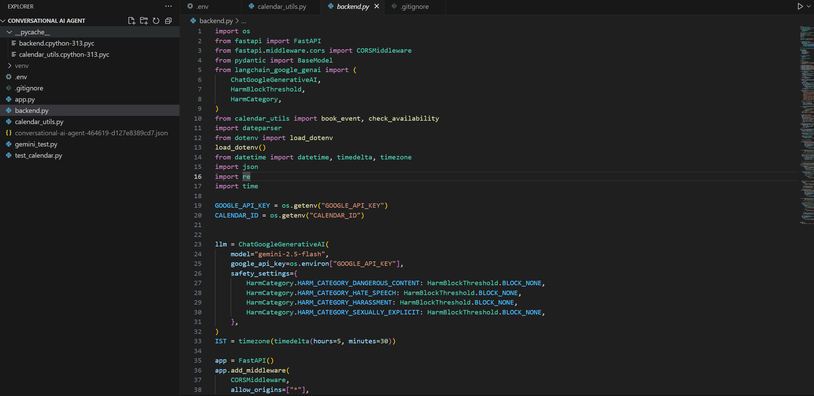

ConversationalAiAgent2
A conversational AI-powered scheduling assistant that lets users book Google Calendar events using natural language, built with FastAPI (backend), Streamlit (frontend), and Gemini (LLM).

🚀 Features
Natural language scheduling: Book, check, and suggest meeting times by chatting naturally.

Google Calendar integration: Events are created directly in your Google Calendar via a service account.

LLM-powered slot extraction: Uses Gemini via LangChain to understand user intent and extract event details.

Streamlit chat UI: Friendly, modern frontend for interactive conversations.

Secure: API keys and credentials are managed via environment variables and never committed to the repo.

🗂️ Project Structure
text
.
├── app.py              # Streamlit frontend
├── backend.py          # FastAPI backend (LLM, slot filling, booking logic)
├── calendar_utils.py   # Google Calendar utility functions
├── requirements.txt    # Python dependencies
├── .gitignore          # Git ignore file (excludes secrets, venv, etc.)
└── README.md           # This file
⚡ Quick Start
1. Clone the repository
text
git clone https://github.com/AshrithRedx/ConversationalAiAgent2.git
cd ConversationalAiAgent2
2. Set up your environment
text
python -m venv venv
# Activate the venv:
# On Windows:
venv\Scripts\activate
# On Mac/Linux:
source venv/bin/activate

3. Install dependencies
text
pip install -r requirements.txt

4. Set up your environment variables
Create a .env file in the project root (do NOT commit this file) with:

text
GOOGLE_API_KEY=your-google-api-key
CALENDAR_ID=your-calendar-id@gmail.com
GOOGLE_APPLICATION_CREDENTIALS=path/to/your/service-account.json
Make sure your service account JSON file is not tracked by git.

5. Share your Google Calendar with your service account
Go to Google Calendar → Settings & sharing → Share with specific people.

Add your service account email (from the JSON file) with "Make changes to events" permission.

6. Run the backend
text
uvicorn backend:app --reload
7. Run the frontend
text
streamlit run app.py

## 📸 Screenshots

### Frontend (Streamlit)

### Backend (FastAPI)

 

